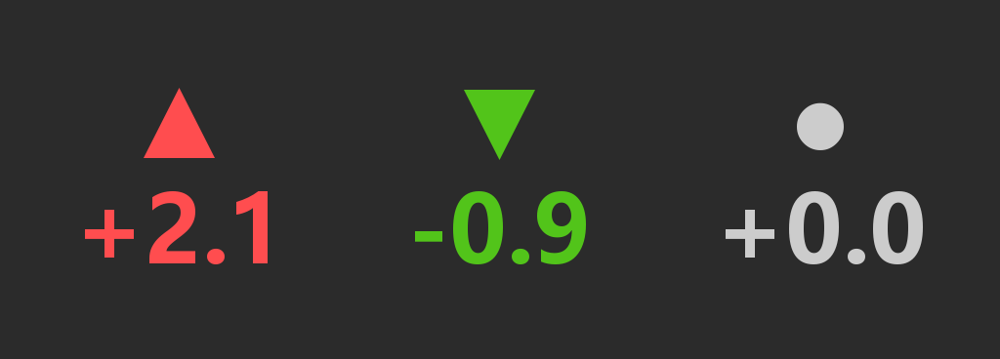

# StockGlance

> 🤖 **本项目完全由 [GenericAgent](https://github.com/lsdefine/GenericAgent) 自主开发** —— 从需求分析、架构设计、编码实现、打包发布到本份文档，全部由 GenericAgent 独立完成，没有人类手写一行代码。

一个 Windows 系统托盘实时股票行情小组件。作为一个常驻图标停在系统托盘区（和飞书、微信等图标同排），轮播展示你关注的股票的**现价**和**涨跌幅**，红涨绿跌，一眼掌握行情，永远不会被其它窗口盖住。

> 行情数据来自腾讯财经（主）与新浪财经（备用），无需 API Key，支持 A 股、港股、美股。

## 关于 GenericAgent

GenericAgent 是一个具备文件读写、脚本执行、浏览器操作与系统级干预能力的自主智能体。StockGlance 就是它交付的成果之一，完整走过了一个真实软件项目的全流程：

- **需求澄清**：把「想在托盘随时看行情」的模糊想法拆成可执行的功能点
- **架构设计**：数据源容错、托盘渲染、悬浮窗、配置系统分层解耦
- **编码实现**：全部 Python 模块由 Agent 编写，含跨平台软降级处理
- **验证打包**：PyInstaller 单文件 exe，冒烟测试进程存活确认
- **开源交付**：README、CHANGELOG、CONTRIBUTING、LICENSE 等标准文档齐备，推送到 GitHub

从一个模糊想法到可运行、可发布的软件，整个过程由 GenericAgent 自主完成。项目地址：https://github.com/lsdefine/GenericAgent

## 项目展示

**系统托盘图标**：常驻托盘区，轮播每只股票的涨跌方向与涨跌幅，红涨绿跌，一眼掌握行情。



**悬浮行情条（深色主题）**：`--float` 模式下贴屏幕右下角，横向滚动展示名称、现价与涨跌幅。


**悬浮行情条（浅色主题）**：内置多套配色，浅色 pearl 主题适合亮色桌面。


> 以上示意图由程序自身的渲染逻辑生成，行情数据为公开大盘指数与蓝筹股示例，不代表任何投资建议。

## 特性

- 🎯 常驻系统托盘，和飞书/微信图标同排，永不被其它窗口遮挡
- 🔄 图标轮播每只股票的涨跌方向（▲▼）与涨跌幅，红涨绿跌
- 🖱️ 悬停显示当前股票完整行情，右键菜单一次性列出所有股票 + 立即刷新 + 退出
- 🌐 双数据源自动容错（腾讯 → 新浪）
- ⚙️ 全部通过 `config.json` 配置：股票、刷新间隔、颜色
- 🪟 可选悬浮窗模式（`--float`），贴屏幕右下角显示滚动行情条
- 📦 纯 Python，依赖轻量（pystray + Pillow）

## 安装

需要 Python 3.9+。

```bash
git clone https://github.com/JeanStory/stock-glance.git
cd stock-glance
pip install -r requirements.txt
```

或作为包安装：

```bash
pip install .
```

## 使用

```bash
# 系统托盘模式（默认，推荐）；首次运行自动生成 config.json
python -m stock_glance

# 临时指定股票，不改配置
python -m stock_glance -s 600519 000001 00700.HK

# 悬浮窗模式：贴屏幕右下角的滚动行情条（旧行为，可选）
python -m stock_glance --float

# 指定配置文件 + 调试日志
python -m stock_glance -c my.json -v
```

安装后也可以直接用命令 `stock-glance`。

启动后到系统托盘区找那个新出现的行情图标（若被折叠，点任务栏的「^」展开隐藏图标）：图标会轮播各只股票的涨跌方向和涨跌幅，鼠标悬停看当前股票完整信息，右键看全部股票列表并可刷新或退出。

## 股票代码写法

| 输入            | 说明                          |
| --------------- | ----------------------------- |
| `600519`        | 6/9 开头自动识别为沪市        |
| `000001`        | 0/2/3 开头自动识别为深市      |
| `sh600519`      | 带市场前缀，原样使用          |
| `00700.HK`      | 港股，自动补零到 5 位         |
| `hk00700`       | 港股，带前缀                  |
| `sh000001`      | 指数（上证指数）              |

## 配置说明（config.json）

| 字段              | 默认值            | 说明                                   |
| ----------------- | ----------------- | -------------------------------------- |
| `symbols`         | 见示例            | 要展示的股票代码列表                   |
| `refresh_interval`| `5`               | 行情刷新间隔（秒）                     |
| `source_type`     | `tencent`         | 行情数据源：`tencent`（主）/ `sina`（备）|
| `scroll_speed`    | `2`               | 滚动速度（像素/帧），越大越快          |
| `scroll_fps_ms`   | `30`              | 滚动帧间隔（毫秒），越小越顺滑         |
| `width` / `height`| `380` / `30`      | 组件尺寸（像素）                       |
| `font_family`     | `Microsoft YaHei` | 字体                                   |
| `font_size`       | `12`              | 字号                                   |
| `bg_style`        | `transparent`     | 悬浮窗背景：`transparent`（透明）/ `solid`（实色）|
| `bg_color`        | `#1e1e1e`         | 背景色（`bg_style` 为 `solid` 时生效） |
| `up_color`        | `#ff4d4f`         | 上涨文字颜色                           |
| `down_color`      | `#52c41a`         | 下跌文字颜色                           |
| `flat_color`      | `#cccccc`         | 平盘文字颜色                           |
| `embed_taskbar`   | `false`           | 悬浮窗模式（`--float`）下是否尝试嵌入任务栏 |
| `margin_right`    | `8`               | 悬浮模式距屏幕右边距（像素）           |
| `margin_bottom`   | `48`              | 悬浮模式距屏幕底边距（像素）           |
| `display_mode`    | `vertical`        | 悬浮窗显示：`vertical`（逐只停留）/ `scroll`（横向滚动）|
| `vertical_dwell_ms`| `3000`           | `vertical` 模式下每只股票停留毫秒数    |
| `always_on_top`   | `true`            | 悬浮窗是否置顶                         |
| `float_on_start`  | `true`            | 悬浮模式下启动即显示                   |
| `corner_radius`   | `12`              | 悬浮窗圆角半径（像素）                 |
| `transparent_alpha`| `0.85`           | 悬浮窗整体不透明度（0~1）              |
| `hotkey`          | `ctrl+alt+s`      | 全局快捷键：切换悬浮窗显示（仅 Windows）|
| `auto_start`      | `false`           | 是否开机自启动（写入当前用户注册表）   |

## 打包为 exe 发行

发行版无需用户安装 Python，双击 `stock-glance.exe` 即用。

```bash
pip install -r requirements.txt pyinstaller
build.bat
```

产物在 `dist\stock-glance.exe`（单文件，约 16 MB）。也可手动执行：

```bash
pyinstaller --onefile --windowed --name stock-glance ^
  --hidden-import pystray._win32 --hidden-import PIL._tkinter_finder ^
  --hidden-import win32gui --hidden-import win32con --hidden-import win32api ^
  --clean --noconfirm run.py
```

- `--windowed`：无控制台黑窗
- `--onefile`：打成单个 exe
- `--hidden-import pystray._win32`：确保托盘后端被打进 exe，否则运行时报缺后端
- exe 首次运行会在自身目录生成 `config.json`，可直接编辑

## 作为库使用

```python
from stock_glance import fetch_quotes

for q in fetch_quotes(["600519", "00700.HK"]):
    print(q.name, q.price, f"{q.change_pct:+.2f}%")
```

## 工作原理

- `quotes.py`：拉取并解析行情，腾讯为主、新浪兜底，任一代码解析失败不影响其它。
- `tray.py`（默认）：用 `pystray` 在系统托盘常驻图标，`Pillow` 把当前轮播股票的涨跌方向和涨跌幅画进图标；后台线程按间隔刷新数据，另一线程轮播切换股票。悬停 tooltip 显示当前股票，右键菜单列出全部股票并提供刷新/退出。
- `widget.py`（`--float`）：tkinter `Canvas` 承载文本，后台线程按间隔刷新数据，主线程只负责匀速滚动绘制。
- `taskbar.py`：悬浮模式下可选地通过 win32 `SetParent` 把窗口挂到任务栏 `Shell_TrayWnd`；任何异常都软失败并降级为普通悬浮窗。
- `config.py`：读写 `config.json`，首次运行自动生成默认配置。

## 数据源说明

本项目**不自建行情服务，也不存储任何行情数据**，仅在运行时实时调用第三方公开行情接口：

| 数据源 | 接口地址 | 用途 | 是否需要 Key |
| ------ | -------- | ---- | ------------ |
| 腾讯财经 | `qt.gtimg.cn` | 主数据源 | 否 |
| 新浪财经 | `hq.sinajs.cn` | 主源失败时自动回退 | 否 |

- 两个接口均为公开可访问的网页行情接口，返回逗号/分号分隔的文本，程序本地解析出现价与涨跌幅，**不涉及任何鉴权、账号或个人数据**。
- 优先请求腾讯接口，网络异常或解析失败时自动回退到新浪接口，任一只股票解析失败不影响其它股票。
- 支持在 `config.json` 中通过 `source_type` 选择数据源；也可用 `source_url` 指向自建/自定义的兼容接口（自动尝试腾讯/新浪两种文本格式解析）。
- 接口的可用性、字段格式、访问频率限制均由数据提供方决定，可能随时变更或失效，本项目不对其稳定性负责。
- 请合理控制刷新频率（默认 5 秒），避免对公开接口造成过大压力；如需高频或商用行情，请使用官方授权的付费数据服务。

## 免责声明

- 本软件为**免费开源的技术演示项目**，仅用于个人学习、研究与技术交流。
- 软件展示的所有行情数据来自上述第三方公开接口，**仅供参考，可能存在延迟、错误或中断，不保证准确性、完整性与实时性**。非交易时段接口返回的是上一交易日的收盘数据。
- 本软件展示的任何信息**均不构成投资建议、要约或任何形式的操作指引**。据此进行的任何投资决策及由此产生的盈亏与风险，由使用者自行承担。
- 本软件按“现状”（AS IS）提供，不附带任何明示或默示的担保。因使用或无法使用本软件所导致的任何直接或间接损失，作者与 GenericAgent 均不承担责任。
- 使用本软件即表示你已知悉并同意上述条款。请遵守数据提供方的服务条款及所在地区的相关法律法规。

## 注意事项

- 默认的系统托盘模式依赖 `pystray` + `Pillow`，是 Windows 上最稳定的常驻形态，不会被其它窗口遮挡。
- 悬浮窗模式（`--float`）依赖 `pywin32`，不同 Windows 版本表现可能不同，若任务栏嵌入失败会自动降级为普通悬浮窗。

## License

[MIT](LICENSE)

---

<sub>🤖 Built entirely by GenericAgent — an autonomous AI software engineer.</sub>
